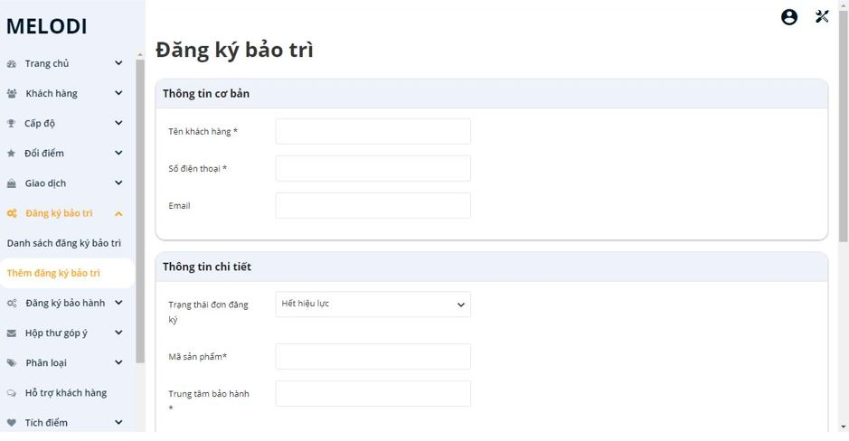
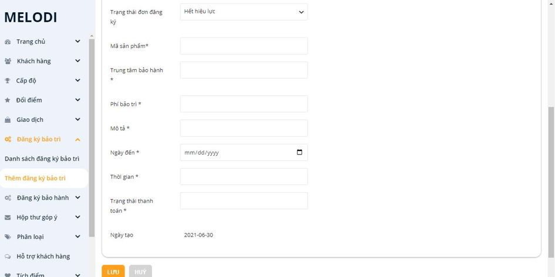
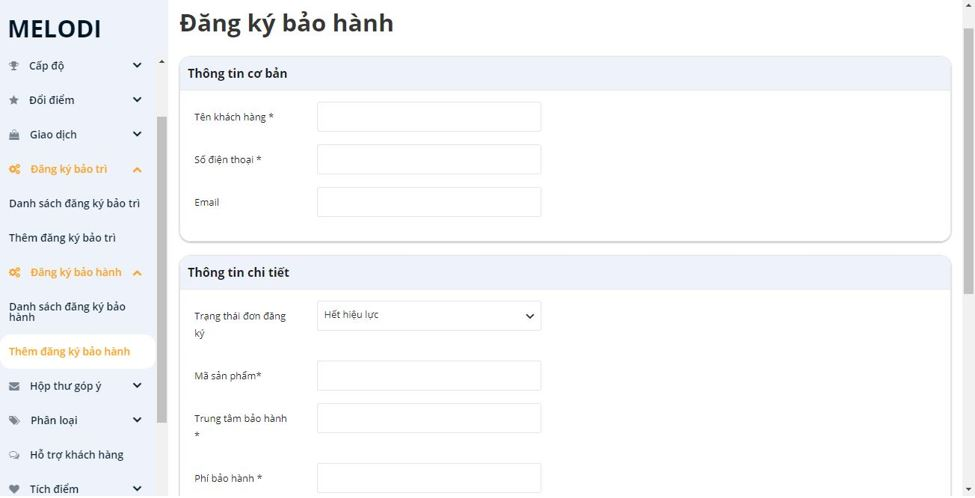
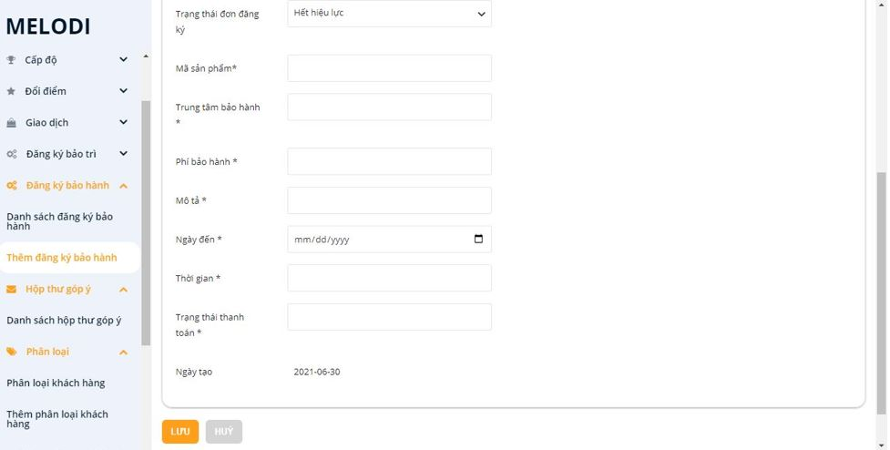
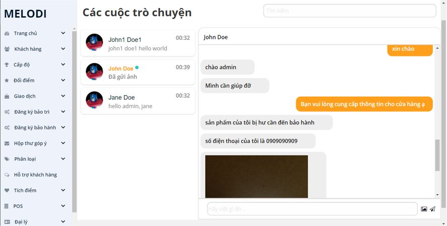
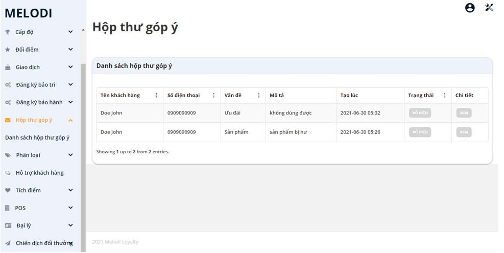
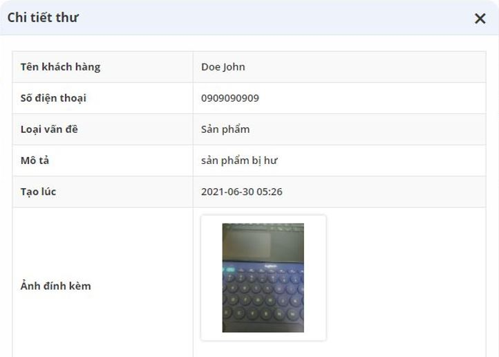
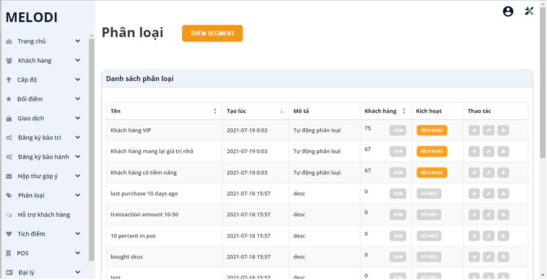

# Melodi

Melodi is a membership point system built from Open Loyalty.


## Table of Content
* [Features](#features)
* [Screenshots](#screenshots)
* [Quick Install](#quick-install)
* [Technologies](#technologies)
* [Documentation](#documentation)
* [Authors](#authors)

## Features:
* Schedule Maintenance
* Schedule Warranty
* Realtime Chat
* Feedback
* Segment customer automatically

## Screenshots:
* Schedule Maintenance:
  <p align="middle">
  
    
  </p>
  
* Schedule Warranty:
  <p align="middle">
  
    
  </p>

* Realtime Chat:
  <p align="middle">
  
  </p>
  
* Feedback:
<p align="middle">

 
</p>

* Segment customer automatically
<p align="middle">

</p>
 
## Quick Install:

```
./docker/base/build_dev.sh
```

and run containers:

```
docker-compose -f docker/docker-compose.dev.yml up
```

Remember to setup database using bellow command:

```
docker-compose -f docker/docker-compose.dev.yml exec --user=www-data php phing setup
```

After starting Open Loyalty in developer mode, it exposes services under slightly different URLs:

 * http://openloyalty.localhost:8081/admin - the administration panel,
 * http://openloyalty.localhost:8081/client - the customer panel,
 * http://openloyalty.localhost:8081/pos - the merchant panel,
 * http://openloyalty.localhost - RESTful API port
 * http://openloyalty.localhost/app_dev.php/doc - swagger-like API doc

## Technologies:
* Database: Postgresql, Elastic Search
* Frontend: Angularjs
* Backend: Symfony

## Documentation:
Technical documentation of Open Loyalty is located [here](backend/doc/index.rst).

## Authors:
* Bùi Xuân Nhã - nhabui137@gmail.com
* Nguyễn Thị Kim Phương - nguyenphuong9995@gmail.com

